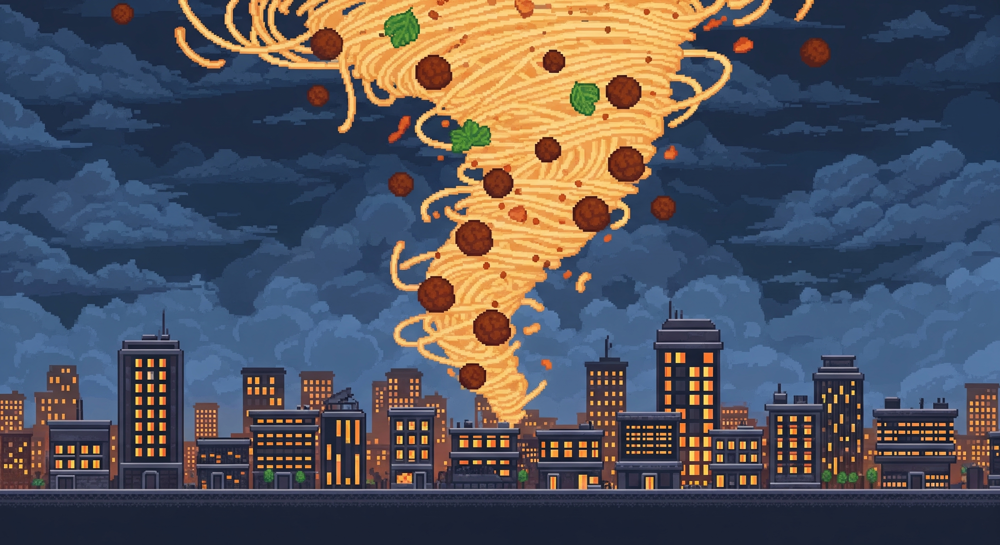
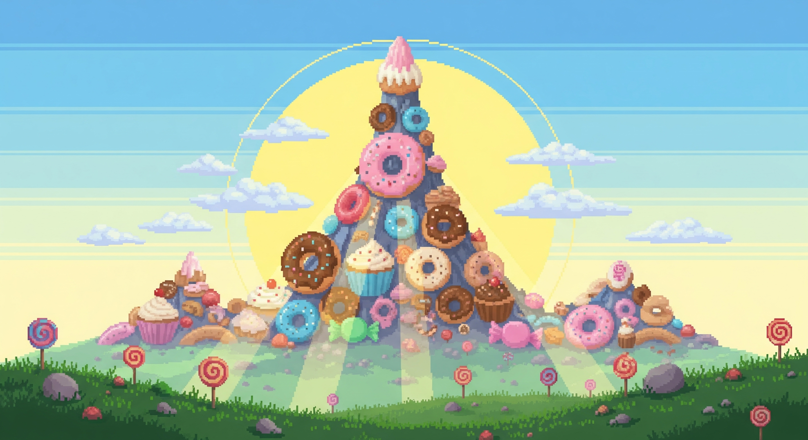
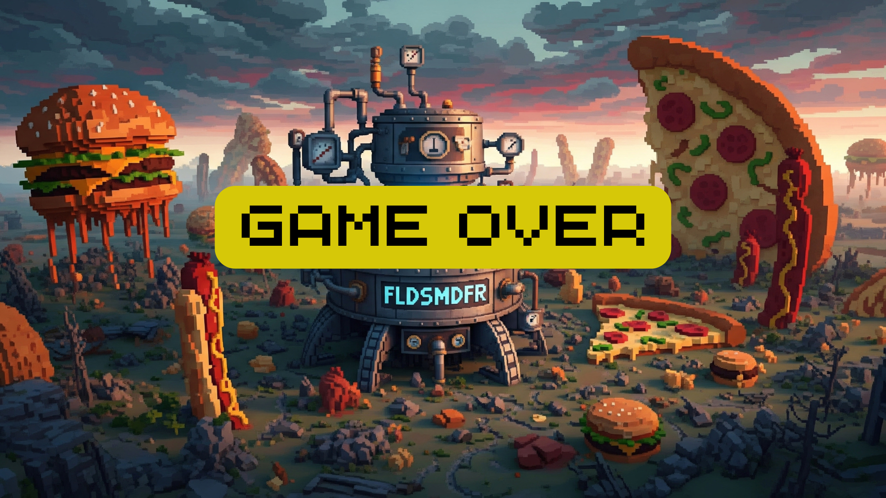

# Projeto IP - equipe 1
# Introduçao

- Este é um mini-jogo de plataforma desenvolvido em Pygame, inspirado na clássica animação "Tá Chovendo Hambúrguer". Nele, você pode escolher entre o inventor Flint Lockwood 👨‍🔬 e seu fiel companheiro, o Macaco Steve 🐒, para enfrentar uma chuva de comidas e perigos.
O jogo é dividido em duas fases distintas, cada uma com seus próprios desafios e objetivos.

## **As Fases do Jogo**
- **Fase 1: A Chuva de Hambúrgueres**

Na primeira fase, seu objetivo é sobreviver à chuva de alimentos enquanto coleta 15 hambúrgueres 🍔 para avançar. No entanto, o céu não está apenas para delícias
Bombas 💣 Evite-as a todo custo ou você perderá uma vida.
Cachorros-Quentes Mofados 🌭 Tocar neles não tira vida, mas deixa seu personagem mais lento por alguns segundos, tornando mais difícil desviar dos perigos.

- **Fase 2: Invasão dos Donuts**

Após provar seu valor, você avança para a Fase 2, onde o desafio aumenta drasticamente. A frequência de bombas é muito maior e o objetivo agora é coletar 10 donuts 🍩 para zerar o jogo. Seus reflexos serão testados ao máximo para desviar dos explosivos e pegar os doces.

# Tecnologia utilizadas:
- Python 3.13.3

# Funcionalidades desenvolvidas
- 🎯 Menu inicial com opções de jogar e instruções.
- 📜 Tela de instruções explicando regras e controles.
- 🧍 Seleção de personagem antes de iniciar a partida.
- 🕹 Duas fases jogáveis com objetivos e desafios diferentes.
- 🍔 Coleta de itens bons para ganhar pontos.
- 💣 Desvio de itens ruins para não perder vidas ou pontos.
- 🏆 Sistema de pontuação em tempo real.
- ❤️ Contagem de vidas do jogador.
- 🌀 Efeitos especiais como pulo e lentidão temporária.
- 🔚 Condições de vitória e derrota com tela de game over.

# Bibliotecas utilizadas:

- pygame: Para criação da interface gráfica, controle de eventos e manipulação de imagens/sons.

- random: Para geração de valores aleatórios usados no comportamento do jogo, como a posição e a velocidade dos itens que caem.

- os: Para manipulação de caminhos de arquivos do sistema operacional, garantindo que o jogo encontre as imagens e fontes independentemente de onde for executado (os.path.join).


# Instalação

Siga os passos abaixo para rodar o projeto localmente.

1.  **Clone o repositório:**
    ```bash
    git clone [https://github.com/soninhoxs/projeto-ip-.git](https://github.com/soninhoxs/projeto-ip-.git)
    ```

2.  **Navegue até a pasta do projeto:**
    ```bash
    cd projeto-ip-
    ```

3.  **Crie e ative o Ambiente Virtual (Recomendado):**
    Isso cria um ambiente isolado para as dependências do projeto, evitando conflitos.

   - **No Windows:**
        ```bash
        python -m venv venv
        venv\Scripts\activate
        ```

   - **No Mac/Linux:**
        ```bash
        python -m venv venv
        source venv/bin/activate
        ```
4.  **Instale as dependências:**
    Com o ambiente virtual ativado, instale o Pygame:
    ```bash
    pip install pygame
    ```

5.  **Execute o jogo:**
    O script principal está dentro da pasta `codigo_jogo`.
    ```bash
    cd codigo_jogo
    python main.py
    ```

### Desativando o Ambiente Virtual

Quando terminar de jogar, você pode desativar o ambiente virtual com o simples comando:
```bash
deactivate
```

# 🎬 Tela Inicial 


# 🌧️🍔 Instruçao 


# 🤖💥 Cenarios




# 🍕🎉 Vitoria


# 😞🍔 Derrota


# Membros da equipe:
- Carlos Vinicius Felix da Silva ***cvfs***
- Efraim Santana Bispo da Silva ***esbs***
- Joyce Gabriele da Silva Pereira ***jgsp3***
- João Gustavo Guimaraes Pires ***jggp***
- João Henrique dos Santos Silva ***jhss2***
- Lucas David Lima Ferreira ***ldlf***

# Divisao de tarefas do grupo
- visual: Carlos | Joyce
- código: Efraim | Joao Gustavo | Joao Henrique
- organização geral: Joao Henrique | Lucas David
- slides e relatório: Joao Henrique | Lucas David


# **Relatório de desenvolvimento do projeto**
- **Conceitos de Programação Aplicados**

Para a construção do jogo, nossa equipe aplicou uma variedade de conceitos fundamentais da programação para garantir um código funcional, organizado e de fácil manutenção.
Programação Orientada a Objetos (POO): Foi o paradigma central do projeto. O jogo foi estruturado em Classes (Player, Item, Game), o que permitiu encapsular dados e comportamentos de forma lógica. Cada elemento do jogo se tornou um objeto independente, facilitando o gerenciamento do estado e a interação entre eles.

## **Estruturas de Dados**

**Listas:** Foram essenciais para gerenciar dinamicamente os múltiplos itens (hambúrgueres, bombas) que aparecem na tela. A cada ciclo do jogo, a lista era percorrida para atualizar e desenhar cada item.

**Dicionários:** Foram utilizados para mapear dados de forma eficiente, como associar o nome de um tipo de item (ex: "burger") à sua respectiva imagem carregada, simplificando a lógica de renderização.

**Modularização de Código:** O projeto foi dividido em módulos (arquivos .py separados), cada um com uma responsabilidade clara (player.py para o jogador, settings.py para constantes, etc.). Essa abordagem tornou o código mais limpo, legível e facilitou o trabalho em equipe, permitindo que diferentes membros focassem em partes distintas do sistema sem conflitos.

**Lógica de Programação e Controle de Fluxo:** A base do funcionamento do jogo foi construída com comandos condicionais (if/elif/else) e laços de repetição (while, for). O game loop principal, um laço while, garantiu a execução contínua do jogo, enquanto os condicionais controlaram toda a lógica de movimentação, colisão, pontuação e transição entre os estados do jogo (menu, jogando, fim de jogo).

**Manipulação de Arquivos e Sistema Operacional:** Foi utilizada a biblioteca os para garantir que o jogo pudesse carregar seus assets (imagens, fontes) de forma robusta. A função os.path.join() permitiu construir os caminhos dos arquivos de uma maneira que funciona em diferentes sistemas operacionais, tornando o projeto mais portável.

## **Desafios, Erros e Lições Aprendidas**
- Qual foi o maior erro cometido durante o projeto? Como vocês lidaram com ele?

Erro: O maior erro da equipe foi iniciar o desenvolvimento sem antes garantir que todos os membros tivessem um ambiente de desenvolvimento padronizado e corretamente configurado. Isso resultou em problemas iniciais onde o código funcionava em uma máquina, mas não em outra, devido a diferenças na instalação do Python e das bibliotecas.

Solução: Lidamos com o erro estabelecendo um guia de configuração claro e padronizado para o projeto (documentado no README.md). Adotamos o uso de ambientes virtuais e um guia de instalação das dependências para garantir que todos estivessem trabalhando com as mesmas versões das bibliotecas, eliminando inconsistências.

- **Qual foi o maior desafio enfrentado durante o projeto? Como vocês lidaram com ele?**

Desafio: O maior desafio técnico foi a gestão dos estados do jogo (menu principal, fase 1, fase 2, tela de game over) e as transições entre eles. Garantir que os eventos, a lógica de atualização e a renderização se comportassem corretamente em cada estado exigiu um planejamento cuidadoso da arquitetura do código.

Solução: Implementamos uma máquina de estados simples, onde uma única variável (self.state) controlava o estado atual do jogo. Toda a lógica de update() e draw() era então direcionada por condicionais que verificavam essa variável, garantindo que apenas os elementos do estado ativo fossem processados.

- **Quais as lições aprendidas durante o projeto?**

A importância da organização e modularização: Um projeto bem estruturado desde o início economiza tempo e evita dores de cabeça no futuro.
Versionamento é comunicação: Utilizar o Git com mensagens de commit claras foi essencial para que a equipe entendesse o progresso e as alterações feitas por cada membro.
Planejamento > Código: Gastar tempo planejando a arquitetura do software (como os estados do jogo funcionariam) antes de escrever o código evitou grandes refatorações.
Documentação é crucial: Um README.md bem escrito não é apenas para os outros, mas também para alinhar a própria equipe sobre como instalar, rodar e contribuir com o projeto.

## **Ferramentas e Bibliotecas Utilizadas**
- Ferramentas:

Python 3: Vasta comunidade e ecossistema robusto para desenvolvimento de jogos.
Visual Studio Code: Editor de código adotado pela equipe por sua flexibilidade, terminal integrado e excelente suporte à depuração e ao controle de versão com Git.
Git & GitHub: Utilizados para o controle de versão distribuído, permitindo que a equipe trabalhasse de forma colaborativa e assíncrona, mantendo um histórico completo de todas as alterações no código.

- Bibliotecas:

Pygame: Framework principal do projeto, justificado por ser uma biblioteca consolidada e de fácil aprendizado para o desenvolvimento de jogos 2D em Python, provendo toda a base para gráficos, som e entrada de usuário.

Random: Biblioteca padrão do Python, utilizada para introduzir elementos de aleatoriedade no jogo, como a posição inicial e a velocidade dos itens que caem.

OS: Biblioteca padrão do Python, utilizada para garantir a portabilidade do projeto ao lidar com caminhos de arquivos, tornando o código agnóstico ao sistema operacional.
